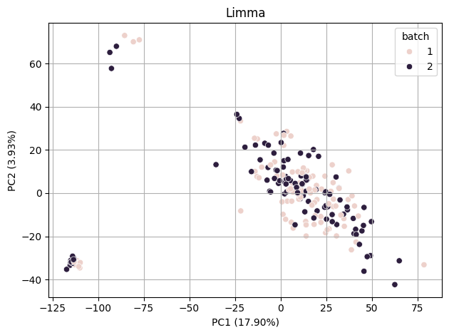
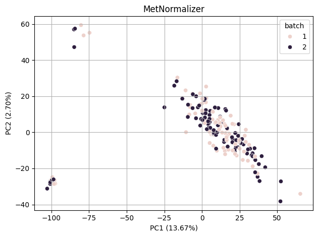

# batch-effect-correction-algorithms
Ported several popular batch-effect-correction algorithms from R to Python

Compare Results to pyCombat from InMoose
1. Limma
2. MetNormalizer
3. Systematic Error Removal using Random Forest (SERRF)

<table>
  <tr>
    <td></td>
    <td></td>
  </tr>
  <tr>
    <td></td>
    <td></td>
  </tr>
</table>